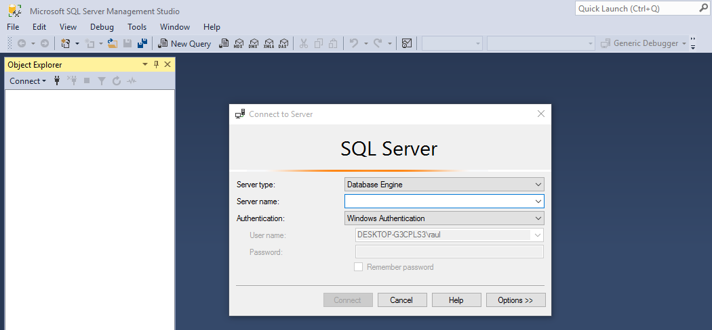

# Instalación de SQL Server 2016

Iniciamos el servidor windows y añadimos la imagen de SQL para ejecutarla.

Iniciamos el instalador de SQL.

Comenzamos la instalación.

Aceptamos los términos de la licencia.

Instalamos las reglas y desactivamos el firewall para que no de problemas.

Seleccionamos e instalamos las características indicadas.

Configuramos la instancia.

Configuramos los ajustes del servidor para que sean automáticos.

Configuramos el motor de la base de datos y seleccionamos la opción **mixto**, le asignamos la contraseña Rasir1417+.

Habilitamos el apartado FILESTREAM.

Resumen de la instalación.

Instalación.

 

Instalación finalizada.

 

## Instalamos el SQL Server Magnament Studio en el servidor.

Conexión desde el servidor.

## Instalamos el SQL Server Magnament Studio en el cliente.

Aplicamos una regla de entrada al firewall desde el programa sql.

Conectamos desde el cliente al servidor por IP.

Comprobamos la conexión.

Conexión por nombre.

