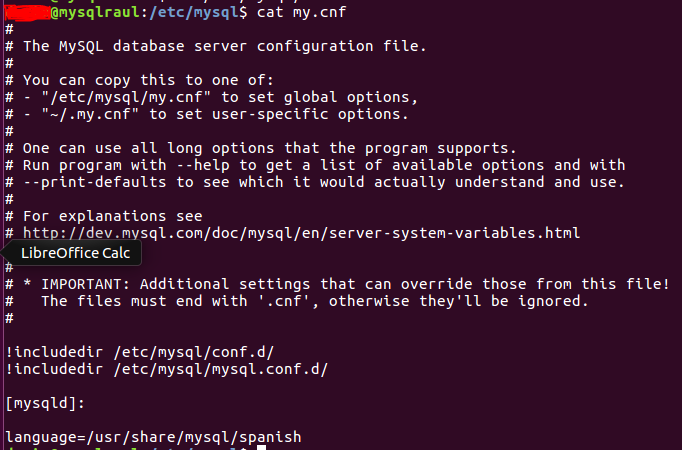
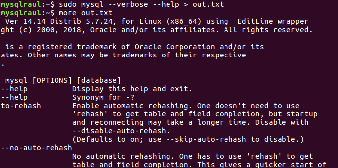
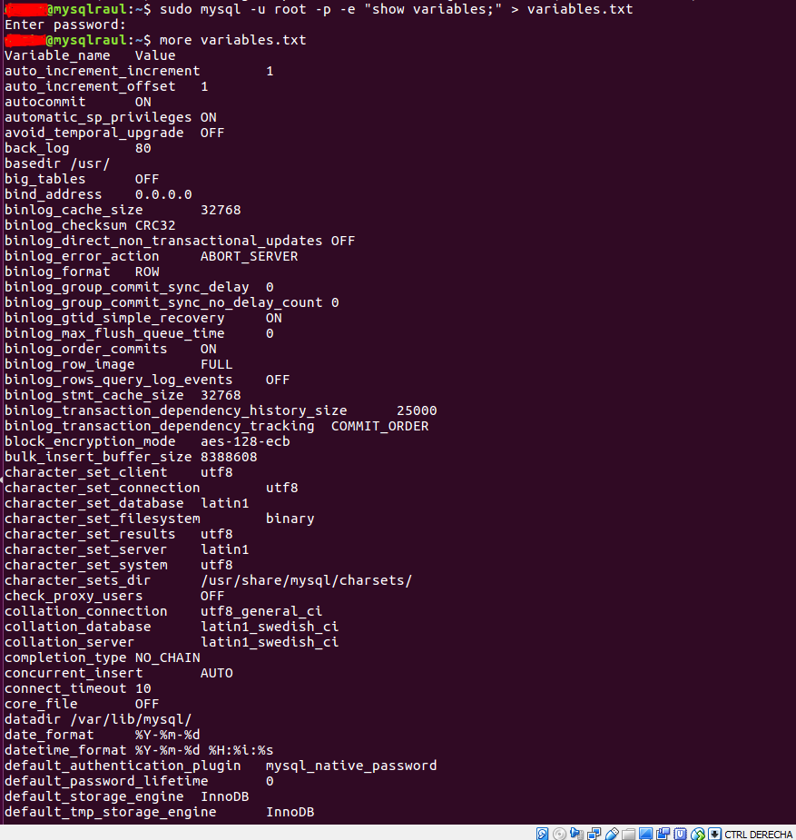
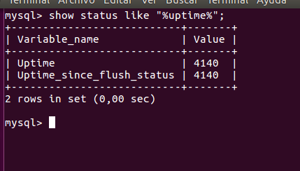
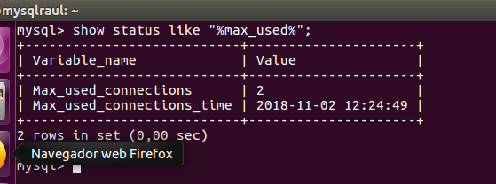
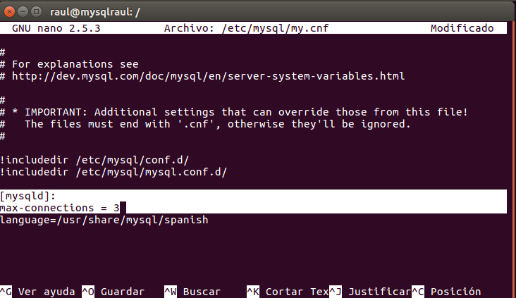

# Fichero de Opciones y variables de servidor

## 1 Ficheros de opciones

### Haz la lectura de la siguiente página "Using Option Files" http://dev.mysql.com/doc/refman/5.7/en/option-files.html

### Encuentra el fichero my.ini(en el caso que tu servidor MYSQL estuviera sobre Windows) o my.cnf de tu instalación de MySQL (podría no estar en una ubicación no estándar).

### Apartado
* ¿Cómo se escribe un comentario en este fichero?
Se escribe con #.
* ¿Y un grupo de opciones?
Grupo = [Client]
* ¿Todas las opciones tienen un valor?
No

### Ejecuta "mysqld --verbose --help" desde una consola para ver una lista de las variables del servidor. Para ver mejor el texto mejor redirecciona la salida a fichero.

### Explica qué significan y que se consigue con cada una de las variables del siguiente fichero de configuración

* [client]

* port=3306; Puerto de escucha.

* password="telesforo"; Contraseña que utiliza el cliente.

* [mysqld]

* port=3306; Puerto de escucha

* key_buffer_size=16M; Tamaño maximo de memoria de clave 16 MB

* max_allowed_packet=8M; Tamaño maximo de paquetes 8MB

* [mysqldump]

* quick; Cuando un copia de seguridad este usando "musqldump" se hara en modo rapido.

## 2 Variables del servidor

* Define qué son las variables del servidor.

* Usa el comando "SHOW VARIABLES" para conocer el valor de todas las variables y enviar el resultado a un fichero (podemos hacerlo desde consola linux y desde el mysql client usando la orden tee.

* Repite lo anterior para mostrar solo las variables relacionadas con el motor "InnoDB".

* Para gestionar variables tenemos, como hemos visto, el comando SHOW "comando":

* cómo mostrar todos los motores de almacenamiento.

Con show engines.

* cómo mostrar el estado actual del servidor.

Con show status.

* cómo averiguar todos los clientes que están conectados al servidor.

Con show processlist.

* cómo conocer todas las tablas que están abiertas.

Con show open tables.

## Variables de estado

* Define qué son las variables de estado.

* Usa el comando "SHOW STATUS" para conocer el valor de todas las variables..

* Haz que uno o más de tus compañeros se conecte a tu servidor (puede que por cuestión de permisos no os podáis conectar).

* Comprueba quién está conectado usando el comando correspondiente (Pista: es un comando visto SHOW XYZ).

* Intenta desconectarlo con el comando "kill"

* ¿Cuántas consultas se están ejecutado hasta el momento en tu servidor MYSQL? ¿Y si se trata de consultas lentas?

* Un estado informa  el sobre el máximo de conexiones concurrentes que se ha dado en la sesión de trabajo. ¿Cuál es?

## 3-Variables dinámicas

* Detalla los posibles atributos que tendría una variable de servidor como "port".

Command-Line Format
System Variable
Name: port
Variable Scope: Golbal
Dynamic Variable: No
Permitted Values
Type: integer
Default: 3306
Min Value: 0
Max Value: 65535

* ¿Cómo podemos saber si una variable es dinámica o no?

Si pone show status es fija y si pone show variable es dinamica

* ¿Qué hace la variable "uptime"?

Indica el tiempo que lleva activo el servidor desde el ultimo reinicio.

* Indica su valor en tu servidor.

¿Es posible modificar su valor con comando SET?

No, no es dinamica.

* Localiza la variable que establece el límite de conexiones concurrentes. ¿Cuál es?

Max used conections.

* Conéctate con tres instancias de la herramienta cliente mysql utilizando un usuario creado previamente (podéis crear el usuario desde WorkBench, es más sencillo).

* Comprueba el valor de la variable de estado que indica cuantas conexiones simultáneas fueron establecidas al servidor Mysql (para ello busca la cadena 'connection' en las variables de estado.

* Modifica la variable del sistema que limita el número de conexiones simultáneas a 3 (busca que variable es de la misma forma que en el paso anterior).

