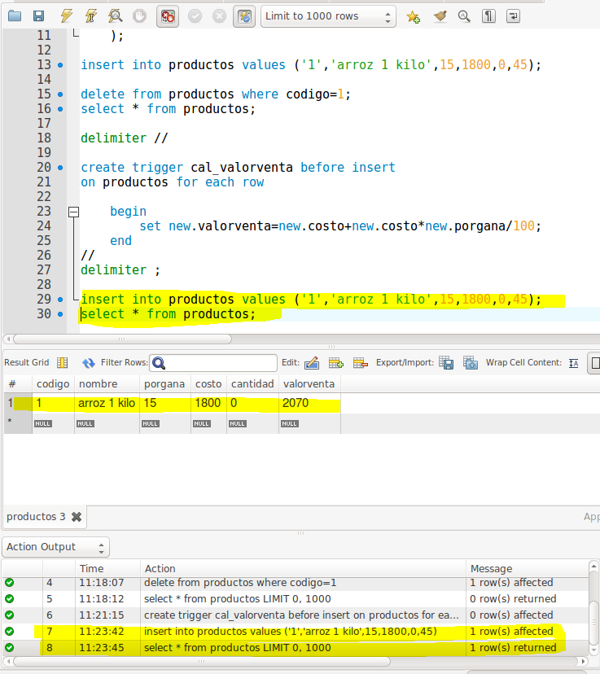

# Trigger inserción y actualización MySQL

## Cree la siguiente tabla:

PRODUCTOS

CODIGO
NOMBRE

PORCENTAJE_DE_GANANCIA

COSTO
VALOR VENTA
CANTIDAD

--  Creando la base de datos

-- Seleccionando la base de datos

-- Creando la tabla

     productos(

          codigo varchar(12) primary key,

          nombre varchar(30),

          porgana int(2),

          Costo int,

          Valorventa int,

          cantidad int

          );

-- Insertando información: observe que enviamos el valorventa en cero(0)

Ejemplo de inserción con valorventa a 0

('1','arroz 1 kilo',15,1800,0,45);

-- observamos lo que se guardo:

-- Borrar los datos de la tabla productos con delete

## Ejercicio 1:

**Se pide crear un disparador de nombre calc_valorventa asociado a la tabla productos para que antes de insertar un nuevo producto calcule el valor de venta con la fórmula siguiente

Fórmula: valorventa=costo + costo*porgana**

-- Volver a hacer la inserción anterior y comprobar los resultados insertados aplicándose el disparador nuevo.

## Ejercicio 2:

**La “idea” es crear un trigger que antes de actualizar un producto vuelva a calcular el valor de venta.**

--Actualizar un producto cambiando el costo a 500 para el código 1

--Observar lo que se actualizo

--Crear el trigger para antes de la actualización

--eliminar, insertar y actualizar para comprobar que se actualiza el valorventa

**//////////////////////////////////////////////////////////////**

# Ejercicio 3:

## Preparar un disparador, para controlar que si  no se introduce porcentaje  de venta en una inserción, es decir es NULL ó 0, se aplique por defecto un  20%.

## Este disparador se debe ejecutar antes que el del ejercicio 1, así que se debe usar la opción precedes para cambiar el orden de los disparadores.

