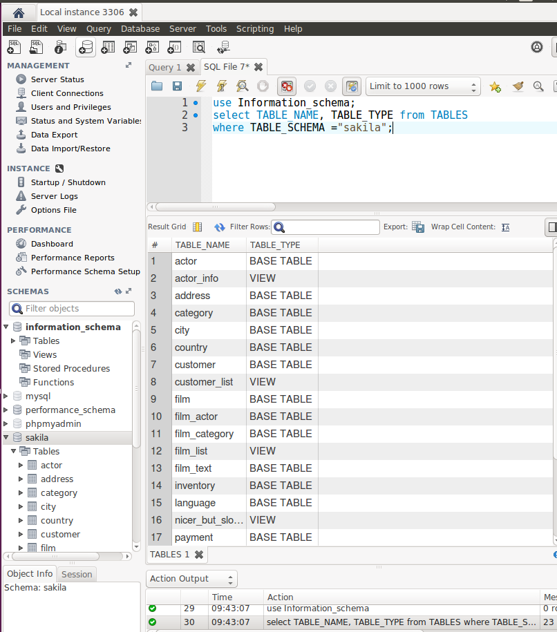
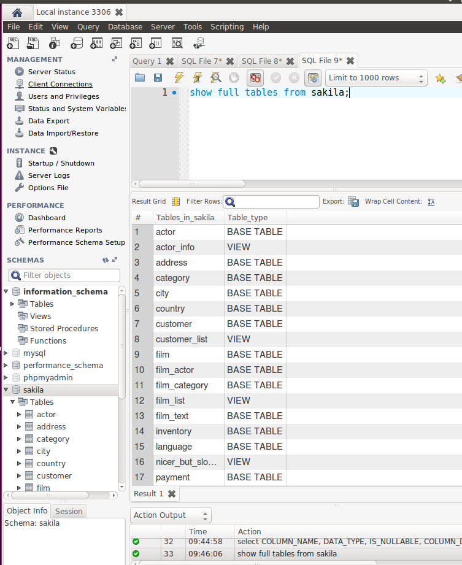
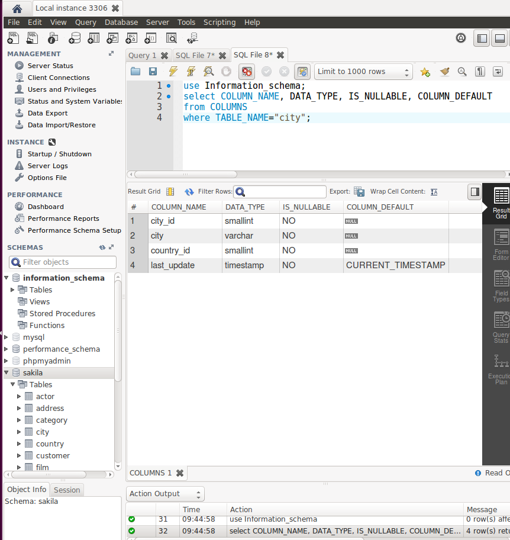
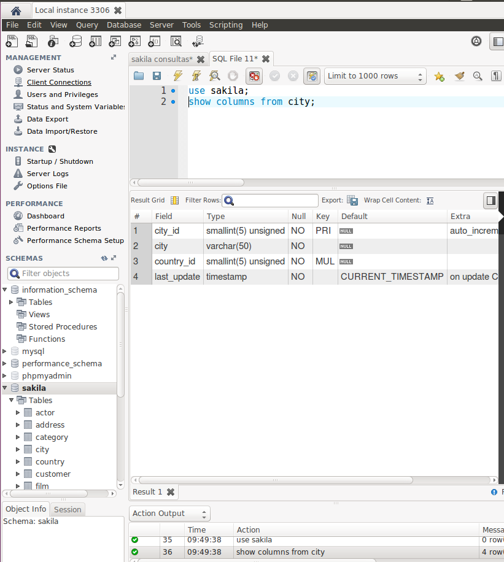
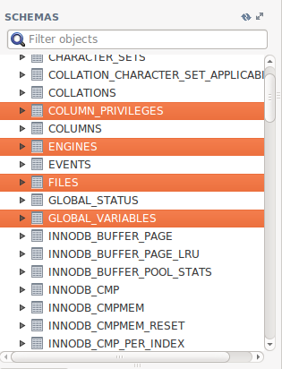
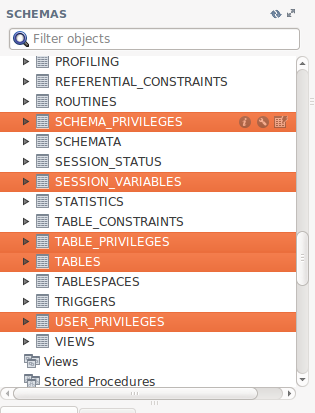

# Diccionario de Datos

**Interrogando la bases de datos Information_schema, extrae información (atributos table_name, table_type) sobre las tablas que conforman la base de datos "sakila".**

**¿Cuál es el comando SHOW equivalente al anterior?**

**Repite lo mismo extrayendo la información sobre el esquema de una tabla en particular de la base de datos "sakila" (atributos column_name, data_type, is_nullable, column_default). Usar tabla columns**

**¿Cuál es el comando SHOW equivalente al anterior?**

**Atendiendo a la base de datos "Information_schema", ¿cuáles son las tablas principales según tu criterio?**

Creo que todas son importantes, pero las tablas de datos, schema, usuarios, privilegios, tablas, variables y engines, son las mas importantes.

