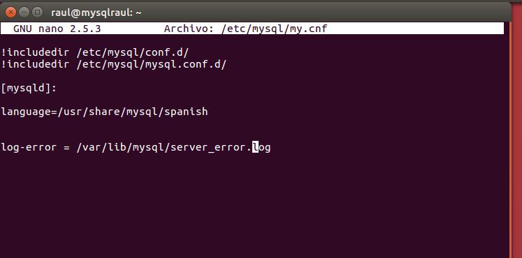
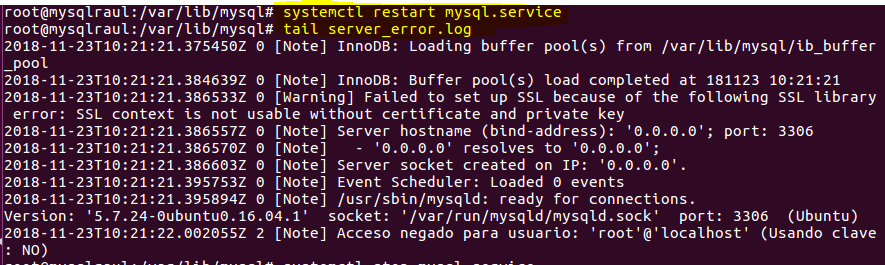
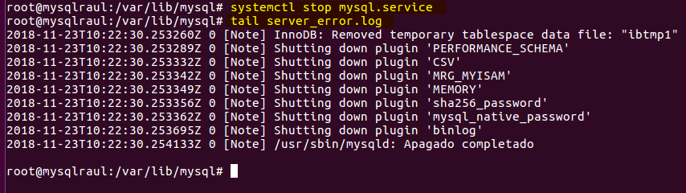
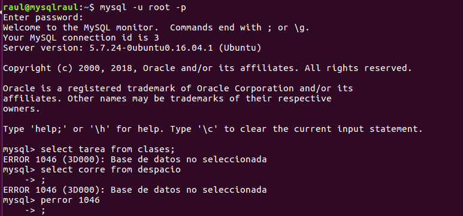
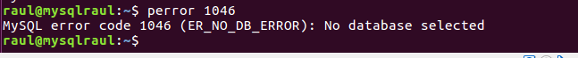
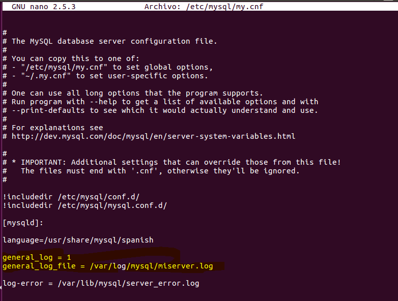
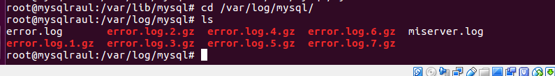
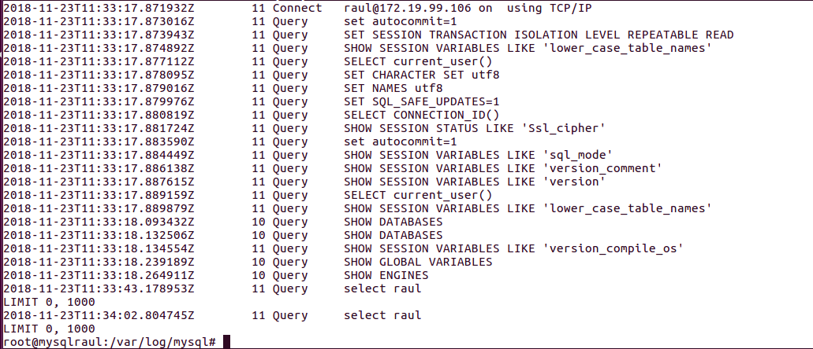
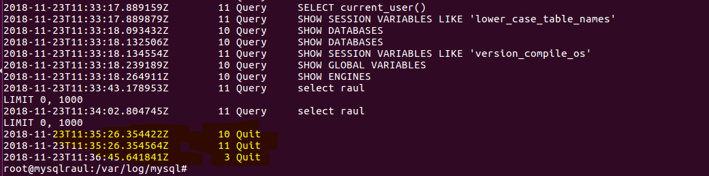
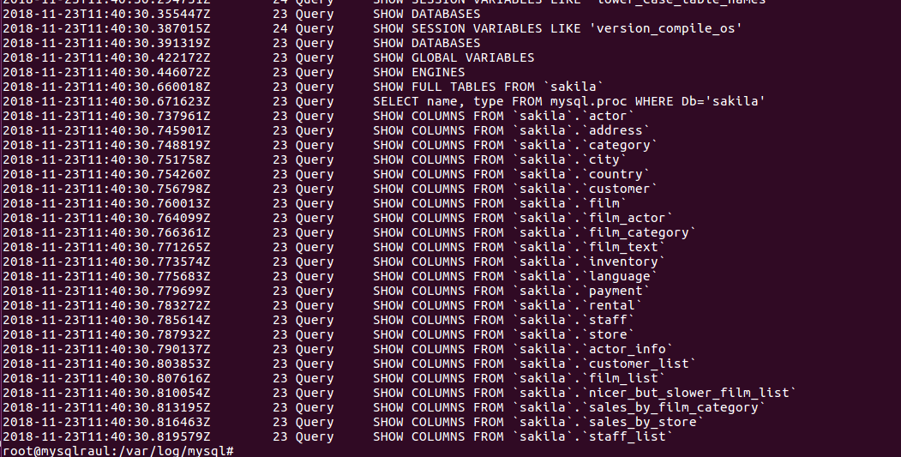

# 4.- Ficheros Log
## Ficheros LOG: Error LOG
El fichero "Error Log" registra problemas encontrados iniciando, ejecutando o parando mysqld.

    MySQL Server Logs: http://dev.mysql.com/doc/refman/5.7/en/server-logs.html
    The Error Log: http://dev.mysql.com/doc/refman/5.7/en/error-log.html

    * Explica qué es y para qué sirve el "ERROR LOG"

**Es el fichero en el que se guardan los errores de mysql, conexiones del servicio, consultas con error etc.**

    * Indica al servidor en "my.cnf" que registre los errores en un fichero llamado "server_error".

    Reinicia el servidor y comprueba los mensajes visualizando dicho fichero.

    * ¿Puedes hacer este cambio de nombre de fichero en la variable de forma dinámica?

    * Detén el servidor abruptamente (haz lo que sea necesario) y comprueba cómo se ha modificado dicho fichero.

    * Prueba la función "perror" incluida en el directorio bin. ¿Cuál es su objeto? Puedes consultar http://dev.mysql.com/doc/refman/5.7/en/perror.html

* hacemos las consultas para comprobar con perror.

# Ficheros LOG: General Query LOG
## El fichero "Global Query  Log" registra las conexiones establecidas por los clientes y las sentencias ejecutadas por ellos.

Haz la lectura de la siguiente página y contesta a las preguntas razonadamente:

    MySQL Server Logs: http://dev.mysql.com/doc/refman/5.7/en/server-logs.html
    The General Query Log: http://dev.mysql.com/doc/refman/5.7/en/query-log.html

    * Explica qué es y para qué sirve el "GENERAL QUERY LOG"

Es el fichero donde se guarda todo lo que se haga en MySQL, desde consultas o conexiones(remotas o locales) incluso si entramos por el cliente o por un programa como Workbench.

    * Configura MySQL para registrar consultas generales en el fichero denominado "miserver.log".

    * Comprueba su funcionamiento haciendo que un compañero se conecte a tu servidor y ejecute varias consultas.

    * ¿Puede ejecutarse el cambio de forma dinámica en el servidor?

**No, no se puede no es dinamica**

    * Averigua viendo el fichero "miserver.log" la hora en que se conectó tu compañero y ejecutó las consultas del apartado anterior.

    * Accede al servidor a través de Workbench. ¿Qué se registra en "general_log"?

    ¿Hay alguna diferencia respecto al cliente mysql ?
**si, muestra el contenido de las bases de datos.**

